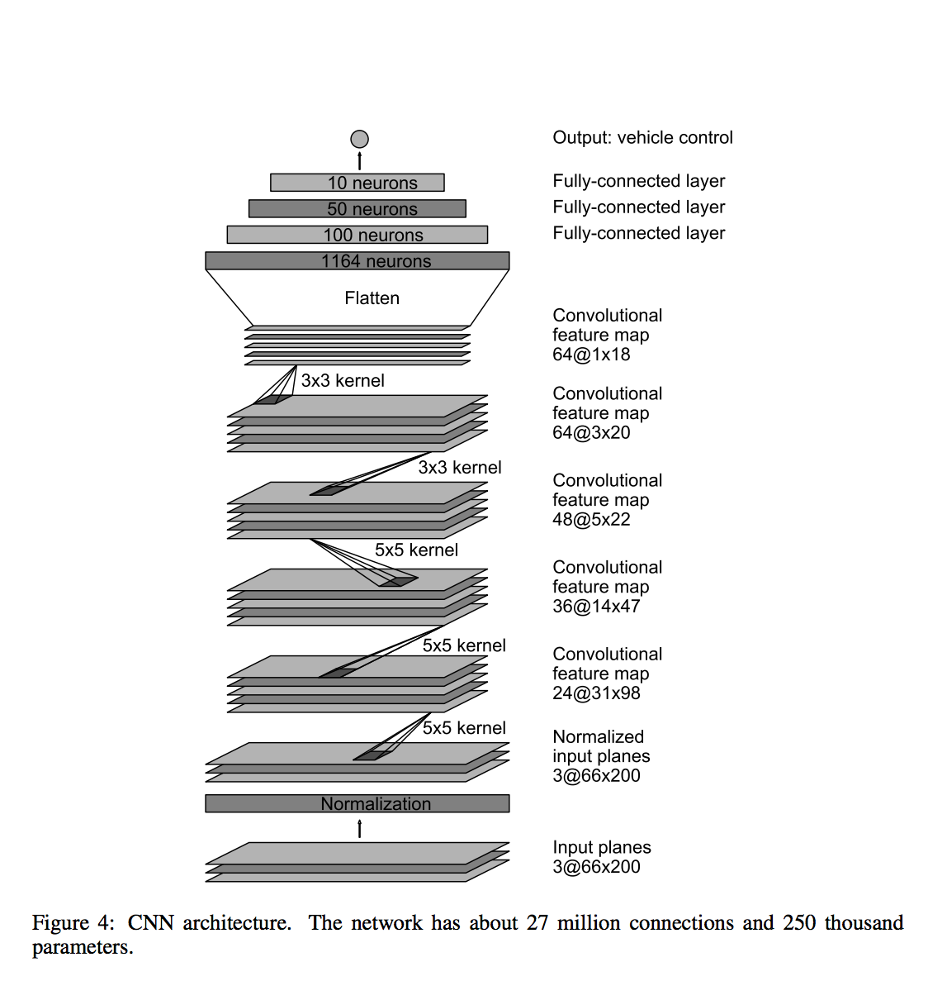

# Architecture of the network
The architecture of the network was taken from the nvidia paper referenced in the task.

|Layer (type) | Output Shape | Param # | Connected to |                
| :--- | :--- | ---: | :--- |
| maxpooling2d_20 | (MaxPooling2D) | (None, 33, 66, 3) | 0 | maxpooling2d_input_20[0][0]      
| lambda_20 (Lambda) | (None, 33, 66, 3) | 0 | maxpooling2d_20[0][0] |            
| convolution2d_96 (Convolution2D) | (None, 9, 17, 5) | 1805 | lambda_20[0][0] |
| elu_172 (ELU) | (None, 9, 17, 5) | 0 | convolution2d_96[0][0] |
| convolution2d_97 (Convolution2D) | (None, 5, 9, 5) | 4505 | elu_172[0][0] |
| elu_173 (ELU) | (None, 5, 9, 5) | 0 | convolution2d_97[0][0] |           
| convolution2d_98 (Convolution2D) | (None, 3, 5, 5) | 6005 | elu_173[0][0] |                    
| elu_174 (ELU) | (None, 3, 5, 5) | 0 | convolution2d_98[0][0] |
| convolution2d_99 (Convolution2D) | (None, 2, 3, 3) | 2883 | elu_174[0][0] |                    
| elu_175 (ELU) | (None, 2, 3, 3) | 0 | convolution2d_99[0][0] |        
| convolution2d_100 (Convolution2D) | (None, 1, 2, 3) | 1731 | elu_175[0][0] |                    
| flatten_20 (Flatten) |  (None, 6)| 0 | convolution2d_100[0][0] |          
| dropout_26 (Dropout) | (None, 6)| 0| flatten_20[0][0] |         
| elu_176 (ELU) | (None, 6)| 0| dropout_26[0][0]   |               
| dense_96 (Dense) | (None, 1164)| 8148| elu_176[0][0]    |                 
| dropout_27 (Dropout) | (None, 1164)| 0| dense_96[0][0]    |                
| elu_177 (ELU) | (None, 1164)| 0| dropout_27[0][0]     |             
| dense_97 (Dense) | (None, 100)| 116500| elu_177[0][0]  |                   
| dropout_28 (Dropout) | (None, 100)| 0| dense_97[0][0]  |                  
| elu_178 (ELU) | (None, 100)| 0| dropout_28[0][0]  |                
| dense_98 (Dense) | (None, 50)| 5050| elu_178[0][0] |                    
| dropout_29 (Dropout) | (None, 50)| 0| dense_98[0][0]     |               
| elu_179 (ELU) | (None, 50)| 0| dropout_29[0][0]| 
| dense_99 (Dense) | (None, 10)| 510| elu_179[0][0]| 
| dropout_30 (Dropout) | (None, 10)| 0| dense_99[0][0]| 
| elu_180 (ELU) | (None, 10)| 0| dropout_30[0][0]| 
| dense_100 (Dense) | (None, 1)| 11| elu_180[0][0]   |                  

Total params: 147148

# Training approach
As in the second project an Adam optimizer is used. In order to prevent overfitting, several drop out layers are part of the network as well
as the usual test/train split in the training phase.
