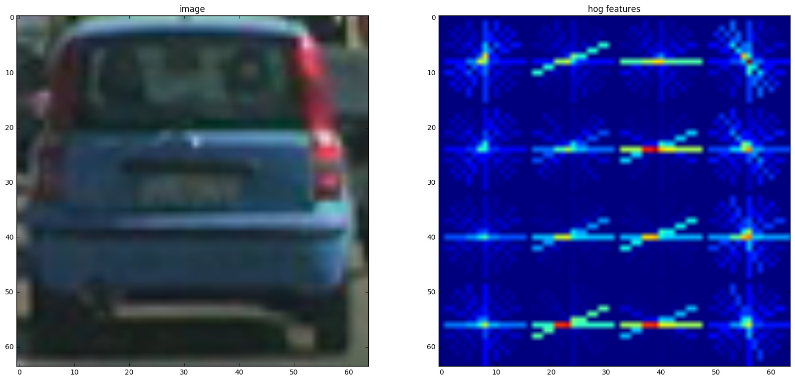
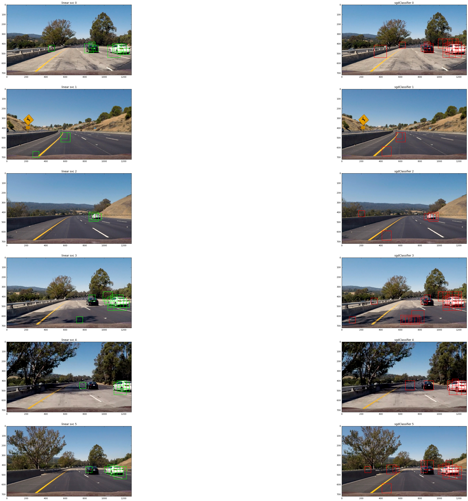

**Vehicle Detection Project**

###Histogram of Oriented Gradients (HOG)

####1. Explain how (and identify where in your code) you extracted HOG features from the training images.

I then explored different color spaces and different `skimage.hog()` parameters (`orientations`, `pixels_per_cell`, and `cells_per_block`).  I grabbed random images from each of the two classes and displayed them to get a feel for what the `skimage.hog()` output looks like.

Here is an example using the `HLS` color space and HOG parameters of `orientations=10`, `pixels_per_cell=(16, 16)` and `cells_per_block=(2, 2)` on the L chanel which seemed to perform best (judging from several classifier training sessions):

The code to generate the image can be found in cell 4 of the jupyter notebook. Based on
several classifier training sessions, I stuck with the above mentioned parameters as
that performed best in terms of training and test accuracy.

####2. Describe how (and identify where in your code) you trained a classifier using your selected HOG features (and color features if you used them).

Cell 5 contains the code to extract features and normalize them. Cell 6 contains
the code training the classifier. I tried both a LinearSVC and a SGDClassifier.

I experimented a bit with GridSearchCV to find better parameters than the standard set,
but decided to not use any special configuration apart from the class balancing.

Below the 6 test images with the windows that each classifier identified as car objects.
The LinearSVC has notably lower false positives.

---

### Video Implementation

####1. Provide a link to your final video output.  Your pipeline should perform reasonably well on the entire project video (somewhat wobbly or unstable bounding boxes are ok as long as you are identifying the vehicles most of the time with minimal false positives.)
Here's a [link to my video result](./project_video.mp4)

####2. Describe how (and identify where in your code) you implemented some kind of filter for false positives and some method for combining overlapping bounding boxes.

I recorded the positions of positive detections in each frame of the video.  From the positive detections I created a heatmap and then thresholded that map to identify vehicle positions.  

---

###Discussion

####1. Briefly discuss any problems / issues you faced in your implementation of this project.  Where will your pipeline likely fail?  What could you do to make it more robust?
The pipeline seems to have problems detecting black cars reliably. Something that worked
fine in the individual images, fails to work now.
